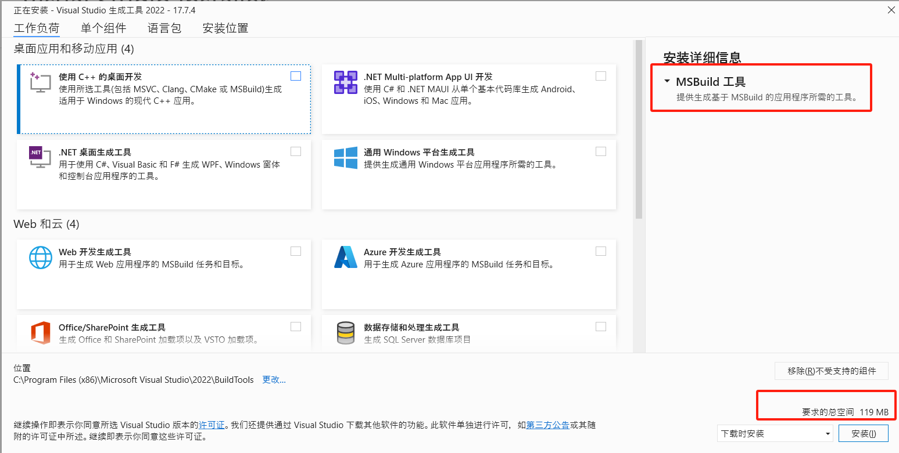

 

[![Badge Discussions]][Discussions]  
[![Badge Discord]][Discord]  
[![Badge Reddit]][Reddit]

[![Badge Status]][Status]  
[![Badge License]][License]

 

# Pulsar

 

[![Button Install]][Install]   
[![Button Documentation]][Documentation]   
[![Button Build]][Build] 

[![Badge Codacy]][Codacy]   
[![Badge Crowdin]][Crowdin]   
[![Badge OpenCollective]][OpenCollective]

 

*A Community-led Hyper-Hackable Text Editor,*
*Forked from [Atom], built on [Electron].*

*Designed to be deeply customizable, but still*
*approachable using the default configuration.*

 
 

[![Preview]][#]

<!---------------------------{ Links }--------------------------->

[OpenCollective]: https://opencollective.com/pulsar-edit
[Discussions]: https://github.com/orgs/pulsar-edit/discussions
[Electron]: https://github.com/electron/electron
[Atom]: https://github.blog/2022-06-08-sunsetting-atom/
[Discord]: https://discord.gg/7aEbB9dGRT 'Join the Pulsar Discord today!'
[Crowdin]: https://crowdin.pulsar-edit.dev
[Status]: https://cirrus-ci.com/github/pulsar-edit/pulsar/master
[Codacy]: https://app.codacy.com/gh/pulsar-edit/pulsar
[Reddit]: https://www.reddit.com/r/pulsaredit/

[#]: #

<!---------------------------{ Documents }--------------------------->

[Documentation]: https://pulsar-edit.dev/docs/ 'Information how to use & work with Pulsar.'
[Install]: https://pulsar-edit.dev/docs/launch-manual/sections/getting-started/#installing-pulsar 'How to install Pulsar on your system.'
[Build]: https://pulsar-edit.dev/docs/launch-manual/sections/core-hacking/#building-pulsar 'Instructions on how to build Pulsar by yourself.'

[License]: LICENSE.md

<!---------------------------{ Images }--------------------------->

[Preview]: resources/readme.png 'Preview of the editor.'

<!---------------------------{ Badges }--------------------------->

[Badge OpenCollective]: https://opencollective.com/pulsar-edit/tiers/badge.svg
[Badge Discussions]: https://img.shields.io/github/discussions/pulsar-edit/.github?style=for-the-badge&labelColor=78af9f&color=5a8377
[Badge Upstream]: https://img.shields.io/badge/Upstream_Status-Sunset-966227.svg?style=for-the-badge&labelColor=c38033
[Badge Discord]: https://img.shields.io/badge/Discord-4b7494.svg?style=for-the-badge&labelColor=6399c4&logoColor=white&logo=Discord
[Badge License]: https://img.shields.io/badge/License-MIT-ac7f31.svg?style=for-the-badge&labelColor=e5ab42
[Badge Crowdin]: https://badges.crowdin.net/pulsar-edit/localized.svg
[Badge Codacy]: https://app.codacy.com/project/badge/Grade/24873ecb93dc4c1d865202ce5b24efc1
[Badge Reddit]: https://img.shields.io/reddit/subreddit-subscribers/pulsaredit?style=for-the-badge&label=Reddit&logoColor=white&logo=Reddit&labelColor=e05d44&color=b14835
[Badge Status]: https://img.shields.io/cirrus/github/pulsar-edit/pulsar?style=for-the-badge&labelColor=c77b7f&label=Build%20Status&color=8d575a

<!--------------------------{ Buttons }--------------------------->

[Button Documentation]: https://img.shields.io/badge/Documentation-6399c4?style=for-the-badge&logoColor=white&logo=GitBook
[Button Install]: https://img.shields.io/badge/Install-78af9f?style=for-the-badge&logoColor=white&logo=DocuSign
[Button Build]: https://img.shields.io/badge/Building-e5ab42?style=for-the-badge&logoColor=white&logo=GNUBash

安装步骤

1. 先翻墙

2. 安装nvm工具：

* 参考文档：https://juejin.cn/post/7177964119717806117
* windows版本下载地址：https://github.com/coreybutler/nvm-windows/releases
* mac版下载地址：https://github.com/nvm-sh/nvm/releases/tag/v0.39.5

3. 使用nvm安装node
* nvm list available
* nvm install 16.20.1
* nvm use 16.20.1

4. 安装yarn：
* npm install -g yarn

5. 安装python3

6. 安装编译工具：
* windows系统：
  * 参考文档：https://keqingrong.cn/blog/2021-02-21-build-tools-on-windows/
  * 下载地址：https://visualstudio.microsoft.com/visual-cpp-build-tools/
  * 按照默认安装，什么插件都不选

* mac系统：
  * 参照文档：https://pulsar-edit.dev/docs/launch-manual/sections/core-hacking/#building-pulsar

7. 下载代码：
* git clone https://github.com/pulsar-edit/pulsar.git && cd pulsar
* git submodule init && git submodule update

8. 下载依赖库，编译Native Node模块（需要切换到项目根目录）
* yarn install
* yarn build
(这一步是最容易出错的，如果在第6步中正确安装了c++编译工具，第8步的错误多数是由于网络原因造成的，请翻墙后多次尝试yarn install)

9. 运行程序
* yarn start